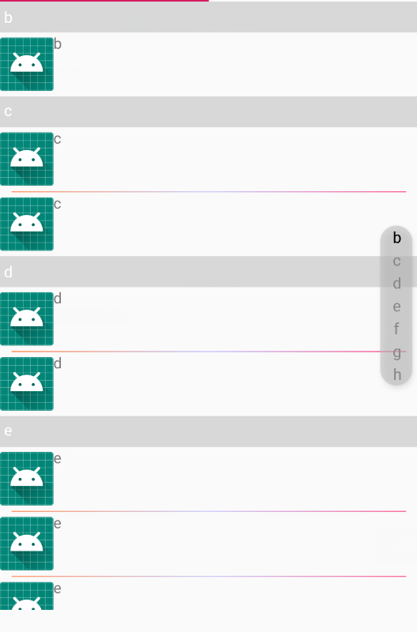

>  IndexBar是继承自AppCompatTextView,需要集成[LevineUtils](/zh-cn/Android/LevineUtils/README),本文中将解释IndexBar和Recyclerview联动实现通讯录列表

### 1.IndexBar简介

```java
public class IndexBar extends AppCompatTextView {

    public IndexBar(Context context) {
        this(context, null);
    }

    public IndexBar(Context context, AttributeSet attrs) {
        this(context, attrs, 0);
    }

    public IndexBar(Context context, AttributeSet attrs, int defStyleAttr) {
        super(context, attrs, defStyleAttr);
        init(context, attrs, defStyleAttr);
    }
```

### 2.IndexBar的使用

#### 在xml文件中使用IndexBar

```xml
<?xml version="1.0" encoding="utf-8"?>
<RelativeLayout xmlns:android="http://schemas.android.com/apk/res/android"
    xmlns:app="http://schemas.android.com/apk/res-auto"
    android:layout_width="match_parent"
    android:layout_height="match_parent"

    android:orientation="vertical">

    <TextView
        android:id="@+id/mIndexTV"
        android:layout_width="80dp"
        android:layout_height="80dp"
        android:layout_centerInParent="true"
        android:background="#90000000"
        android:gravity="center"
        android:textColor="#FFF"
        android:textSize="35sp"
        android:visibility="gone" />

    <com.levine.utils.app.view.IndexBar
        android:id="@+id/mIndexBar"
        android:layout_width="30dp"
        android:layout_height="150dp"
        android:layout_alignParentRight="true"
        android:layout_centerVertical="true"
        android:layout_marginRight="5dp"
        android:elevation="4dp"
        app:pressBackground="@drawable/round_corner_view"
        app:textSize="15sp"
        app:unpressBackground="@drawable/round_corner_view" />

    <com.levine.utils.app.view.RecyclerListView

        android:id="@+id/mFragment1RV"
        android:layout_width="match_parent"
        android:layout_height="match_parent"
        android:orientation="vertical" />

</RelativeLayout>
```

其中TextView是用来显示当前点击的indexbar中字母.

#### 为indexbar设置数据源

```java
   				final IndexBar mIndexBar = holder.getViewAtId(R.id.mIndexBar);
                TextView mIndexTV = holder.getViewAtId(R.id.mIndexTV);
                mIndexBar.setmIndexDatas(list)
                        .setmPressedShowTextView(mIndexTV)
                        .setIndexTextColor(Color.GRAY)
                        .setSelectedTextColor(Color.BLACK)
                        .setRecyclerView(recyclerListView);//实现和recyclerview联动
```

其中list：

```java
List<BaseBean> list = new ArrayList<>();
        BaseBean b1 = new CustomerBean("b");
        BaseBean b2 = new CustomerBean("c");
        BaseBean b3 = new CustomerBean("c");
        BaseBean b4 = new CustomerBean("d");
        BaseBean b5 = new CustomerBean("d");
        BaseBean b6 = new CustomerBean("e");
        BaseBean b7 = new CustomerBean("e");
        BaseBean b8 = new CustomerBean("e");
        BaseBean b9 = new CustomerBean("f");
        BaseBean b10 = new CustomerBean("g");
        BaseBean b11 = new CustomerBean("g");
        BaseBean b12 = new CustomerBean("h");
        list.add(b1);
        list.add(b2);
        list.add(b3);
        list.add(b4);
        list.add(b5);
        list.add(b6);
        list.add(b7);
        list.add(b8);
        list.add(b9);
        list.add(b10);
        list.add(b11);
        list.add(b12);
        return list;
```

CustomerBean：

```java

public class CustomerBean extends BaseBean {

    String name;

    public CustomerBean(String name) {
        this.name = name;
    }

    public String getName() {
        return name;
    }

    public void setName(String name) {
        this.name = name;
    }

    @Override
    public String getBeanType() {
        return name;
    }
}

```

> 注：list的数据类型必须是BaseBean的子类型


#### 设置ItemDecoration

```java
LevineItemDecoration levineItemDecoration =
                     new LevineItemDecoration(mContext, LinearLayout.VERTICAL)
                             .setmPaddingStart(30)
                             .setmPaddingEnd(30)
                             .setDrawable(ContextCompat.getDrawable(mContext, R.drawable.item_divider))
                             .setDataList(list);
recyclerListView.addItemDecoration(levineItemDecoration);
```


当然可以使用自定义其他样式的*[ItemDecoration](/zh-cn/Android/LevineUtils/ItemDecoration)*

最终效果：

