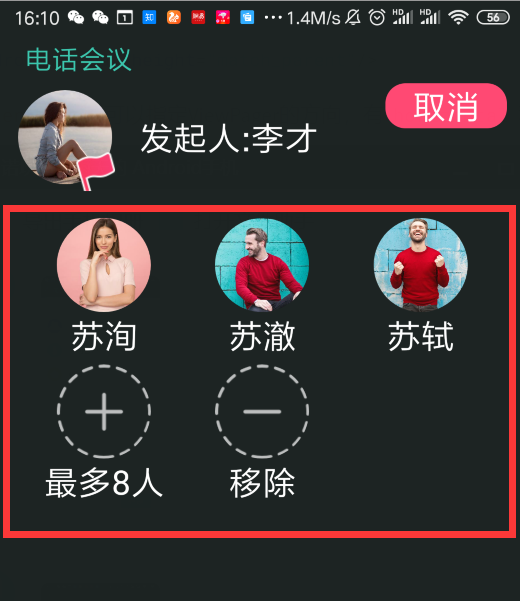

>  RecyclerListView是继承自Recyclerview,需要集成[LevineUtils](/zh-cn/Android/LevineUtils/README)

### 1.RecyclerListView简介

```java
public class RecyclerListView extends RecyclerView {
    public RecyclerListView(@NonNull Context context) {
        this(context, null);
    }

    public RecyclerListView(@NonNull Context context, @Nullable AttributeSet attrs) {
        this(context, attrs, 0);
    }

    public RecyclerListView(@NonNull Context context, @Nullable AttributeSet attrs, int defStyle) {
        super(context, attrs, defStyle);
        init(attrs);
    }
    
    其中init方法：
     private void init(AttributeSet attrs) {
    	....
    	final LinearLayoutManager llm = new LinearLayoutManager(this.getContext());
        llm.setOrientation(orientation);
        this.setLayoutManager(llm);
        SnapHelper snapHelper = new LinearSnapHelper();
        snapHelper.attachToRecyclerView(this);
    	....
}
```

### 2.RecyclerListView的使用

RecyclerListView其实也是*RecyclerView*的一种，同样可以使用我们的[BaseRecyclerViewAdaper](/zh-cn/Android/LevineUtils/BaseRecyclerViewAdapter万能适配器).

#### 在xml文件中使用RecyclerListView

```xml
 <com.levine.utils.app.view.RecyclerListView
        android:orientation="vertical"
        android:id="@+id/mFragment1RV"
        android:layout_width="match_parent"
        android:layout_height="match_parent"/>
```

```android:orientation```可以指定ViewPager的方向，有```horizontal```和```vertical```两个选项.

#### 设置适配器

```java
Fragment1ListviewAdapter adapter = new Fragment1ListviewAdapter(list, mContext, R.layout.list_item_view);
                final RecyclerListView recyclerListView = holder.getViewAtId(R.id.mFragment1RV);
recyclerViewPager.setAdapter(adapter);
```

效果如下：



#### 设置ItemDecoration

```java
 mGridView.addItemDecoration(new DividerItemDecoration(this.getContext(),DividerItemDecoration.VERTICAL));
 mGridView.addItemDecoration(new DividerItemDecoration(this.getContext(),DividerItemDecoration.HORIZONTAL));
```

设置一个纵向的和横向的```ItemDecoration```即可.

当然可以使用自定义其他样式的*[ItemDecoration](/zh-cn/Android/LevineUtils/ItemDecoration)*

