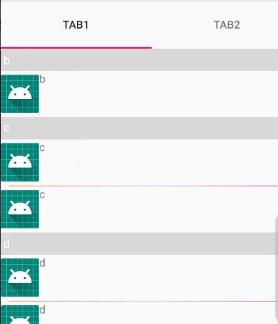

>  RecyclerViewPager是继承自Recyclerview，需要集成[LevineUtils](/zh-cn/Android/LevineUtils/README)

### 1.RecyclerViewPager简介

```java
public class RecyclerViewPager extends RecyclerView {

    public RecyclerViewPager(@NonNull Context context) {
        this(context, null, 0);
    }

    public RecyclerViewPager(@NonNull Context context, @Nullable AttributeSet attrs) {
        this(context, attrs, 0);
    }

    public RecyclerViewPager(@NonNull Context context, @Nullable AttributeSet attrs, int defStyle) {
        super(context, attrs, defStyle);

        init(attrs);
    }
}

其中init方法：
     private void init(AttributeSet attrs) {
    	....
    	final LinearLayoutManager llm = new LinearLayoutManager(this.getContext());
        llm.setOrientation(orientation);
        this.setLayoutManager(llm);
        final SnapHelper snapHelper = new PagerSnapHelper();
        snapHelper.attachToRecyclerView(this);
    	....
}
```

在*RecyclerViewPager*中内置了一个方法*setTabLayout(TabLayout tabLayout)*,用于*RecyclerViewPager*和*TabLayout*联动.


### 2.RecyclerViewPager的使用

*RecyclerViewPager*其实也是*RecyclerView*的一种，同样可以使用我们的[BaseRecyclerViewAdaper](/zh-cn/Android/LevineUtils/BaseRecyclerViewAdapter万能适配器).

#### 在xml文件中使用RecyclerViewPager

```xml
<com.levine.utils.app.view.RecyclerViewPager
        android:id="@+id/mRVPager"
        android:layout_width="match_parent"
        android:layout_height="match_parent"
        android:orientation="horizontal"/>
```

```android:orientation```可以指定ViewPager的方向，有```horizontal```和```vertical```两个选项.

#### 设置适配器

```java

Fragment1RecyclerViewAdapter adapter = new Fragment1RecyclerViewAdapter(pageDatas, this.getActivity(), R.layout.horizontal_viewpager_page_view);
        //多布局支持
        adapter.setMultiTypeSupport(new BaseRecyclerViewAdapter.MultiTypeSupport<HashMap<String, Object>>() {
            @Override
            public int getLayoutId(HashMap<String, Object> item) {
                String type = (String) item.get("type");
                if (type.equals("ad")) {
                    return R.layout.horizontal_viewpager_page_view_ad;
                } else {
                    return R.layout.horizontal_viewpager_page_view;
                }
            }
        });

        adapter.setOnItemClickListener(new BaseRecyclerViewAdapter.OnBaseItemClickListener() {
            @Override
            public void onItemClick(int position) {
                LogUtils.e("adapter.onItemClick");
            }
        });
recyclerViewPager.setAdapter(adapter);
```

#### 设置Tablayout，实现Tablayout和RecyclerViewPager联动

```java
recyclerViewPager.setTabLayout(tabLayout);
```

