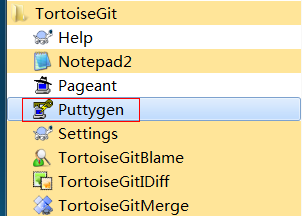
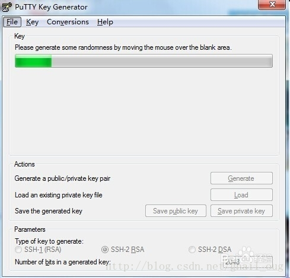
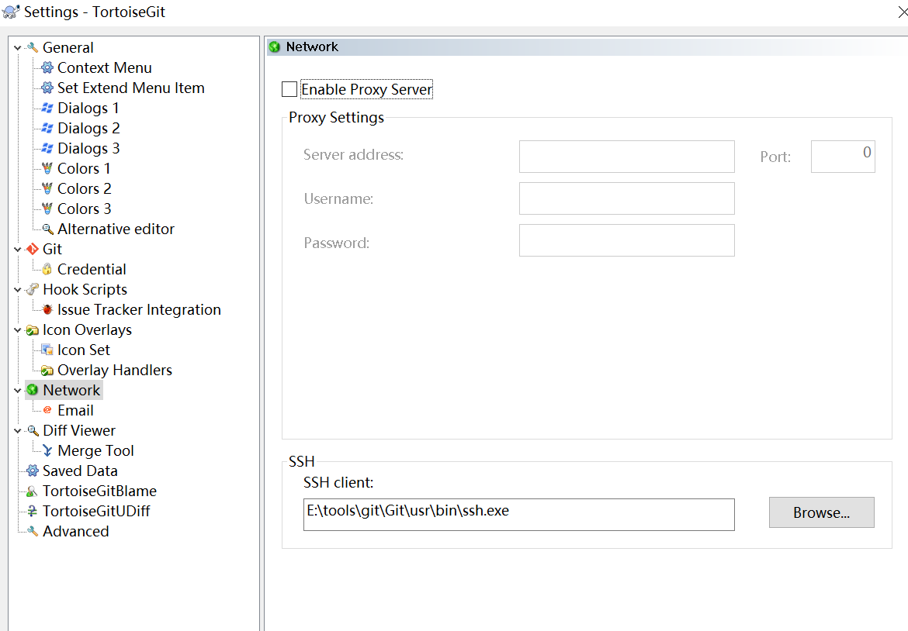

> 由于本地到远程github上用ssh比较方便，不需要每次都输入用户名密码，所以下面记录一下本地仓库与远程github怎么添加ssh加密。

- 打开gitbash,使用cmd也可以
```shell
①  cd ~/.ssh/   【如果没有对应的文件夹，则执行  mkdir  ./.ssh】

②  git config --global user.name "licaiMaker"

③  git config --global user.email "841381242@qq.com"

④  ssh-keygen -t rsa -C "841381242@qq.com"
```
 然后一路回车。这时你就会在用户下的`.ssh`目录里找到`id_rsa`和`id_rsa.pub`这两个文件。（当然在要求输入passphrase的时候可以输入密码，只是下次在push和pull是需要输入这个passphrase,建议是回车直接跳过，下次就可以免密push和pull了）

- 登录Github,找到右上角的图标，打开点进里面的Settings，再选中里面的SSH and GPG KEYS，点击右上角的New SSH key，然后Title里面随便填，再把刚才id_rsa.pub里面的内容复制到Title下面的Key内容框里面，最后点击Add SSH key，这样就完成了SSH Key的加密。

> 注意：在Windows下，进入‘C:\Users\你的用户名\ ’  目录下，然后在cmd中执行上述代码，然后在C:\Users\你的用户名\.ssh下就能找到id_rsa.pub和id_rsa文件了

> 注：如果想在tortoisegit图形工具中使用sshkeys,则有两种方式：

###  1.为tortoisegit里面的puttygen工具添加私钥：

#### a.打开TortoiseGit下的PuttyGen。 



#### b.如果已经在有自己的private-keys了，点击下面的load按钮，加载自己的privatekey:（我的文件目录是：C:\Users\summer\.ssh\id_rsa（我生成的是没有passphase）；如果没有，就用这个软件生成：在打开的窗口中点击Generate按钮，会出现绿色进度条，等下生成，生成过程中可以在多晃晃鼠标增加随机性。



#### c.点击save private key 按钮，保存为.ppk格式,并且将输入框中的公钥复制下来配置在github上。

#### d.在菜单选项中点击pageant,选择add key，将刚刚保存的.ppk文件导入即可

最后就可以在tortoisegit中免密码登录了

### 2.在tortoisegit的setting的network中配置ssh-client

因为我在git中已经配置好了sshkeys,可以直接免密码拉取。

配置我的ssh-client地址为：（目录为git安装目录下的usr\bin\ssh.exe）



配置完成，就可以直接使用tortoisegit 免密码拉取啦

同理可以在pycharm等编辑器中将上面的git.exe的配置好，也可以使用免密推送提交了